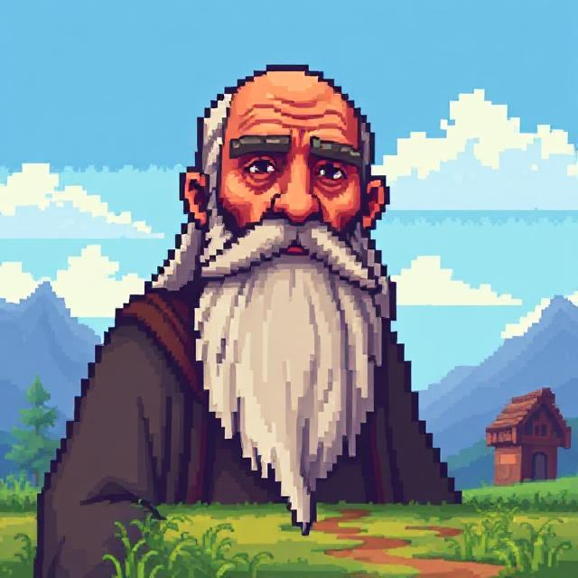

# Stardew Sage 🌱

<div align="center">
  
  <p><em>Your friendly Stardew Valley assistant powered by AI</em></p>
</div>

## 📖 Overview

Stardew Sage is a modern, responsive chatbot assistant designed specifically for Stardew Valley players. It provides instant, accurate information about all aspects of the game, from crop planning to villager relationships, fishing spots to mining strategies.

Built with Next.js, TypeScript, and Tailwind CSS, and powered by Google's Gemini 1.5 Flash AI model, Stardew Sage offers a beautiful, intuitive interface that matches the game's charming aesthetic.

## ✨ Features

- **🧠 Stardew Valley Expertise**: Get detailed answers about crops, villagers, fishing, mining, crafting, and more
- **🎨 Game-Inspired UI**: Beautiful, responsive design with authentic Stardew Valley visual elements
- **📱 Cross-Device Compatibility**: Seamless experience across desktop, tablet, and mobile devices
- **✍️ Rich Text Formatting**: Markdown support for well-structured, easy-to-read responses
- **⚡ Fast Responses**: Powered by Gemini 1.5 Flash for quick, accurate information
- **🔄 Contextual Understanding**: The AI understands follow-up questions and maintains conversation context

## 🛠️ Tech Stack

- **Frontend**: [Next.js 14](https://nextjs.org/), [React 18](https://reactjs.org/), [TypeScript](https://www.typescriptlang.org/)
- **Styling**: [Tailwind CSS](https://tailwindcss.com/) with custom Stardew Valley theme
- **AI Integration**: [Google Gemini 1.5 Flash API](https://ai.google.dev/)
- **Deployment**: [Vercel](https://vercel.com/) (recommended)

## 🚀 Getting Started

### Prerequisites

- Node.js 18+ and npm/yarn
- Google Gemini API key ([Get one here](https://ai.google.dev/))

### Installation

1. **Clone the repository**
   ```bash
   git clone https://github.com/yourusername/stardew-sage.git
   cd stardew-sage
   ```

2. **Install dependencies**
   ```bash
   npm install
   # or
   yarn install
   ```

3. **Environment Setup**
   
   Create a `.env.local` file in the root directory:
   ```
   GEMINI_API_KEY=your_api_key_here
   ```

4. **Start the development server**
   ```bash
   npm run dev
   # or
   yarn dev
   ```

5. **Open your browser**
   
   Navigate to [http://localhost:3000](http://localhost:3000)

## 📁 Project Structure

```
stardew-sage/
├── public/               # Static assets
│   └── icons/            # App icons and images
├── src/                  # Source code
│   ├── app/              # Next.js app router
│   │   ├── api/          # API routes
│   │   │   └── chat/     # Chat API endpoint
│   │   ├── layout.tsx    # Root layout
│   │   └── page.tsx      # Home page
│   ├── components/       # React components
│   │   └── ChatInterface.tsx  # Main chat component
│   └── constants/        # App constants
├── docs/                 # Additional documentation
├── .env.local            # Environment variables (create this)
├── tailwind.config.js    # Tailwind configuration
└── README.md             # This file
```

## 🎨 Customization

### Styling

The project uses a custom Tailwind configuration with Stardew Valley-inspired colors, typography, and UI elements. You can modify the theme in `tailwind.config.js`.

### AI Model

By default, Stardew Sage uses Google's Gemini 1.5 Flash model. See the documentation in the `docs` folder for instructions on how to use different AI models.

## 📚 Documentation

For more detailed documentation, please refer to the [docs](./docs/) directory:

- [Chat Interface Documentation](./docs/chat-interface.md)
- [API Integration Guide](./docs/api-integration.md)
- [Customization Guide](./docs/customization.md)

## 📄 License

This project is licensed under the MIT License - see the [LICENSE](LICENSE) file for details.

## ⚠️ Disclaimer

This project is not affiliated with ConcernedApe or Stardew Valley. It is an unofficial fan project created for educational purposes and to help the Stardew Valley community.

## 🙏 Acknowledgements

- Stardew Valley and all related properties are owned by ConcernedApe
- Powered by Google's Gemini 1.5 Flash API
- Icons and visual elements inspired by Stardew Valley's aesthetic

---

<div align="center">
  <p>Made with ❤️ for the Stardew Valley community</p>
</div>
