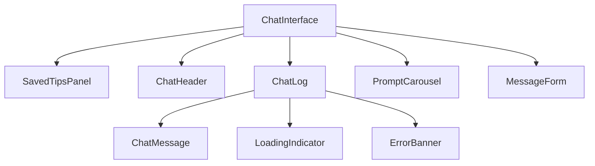

# Chat Interface Guide

## Overview

`src/components/ChatInterface.tsx` orchestrates the full Stardew Sage experience. It composes dedicated chat subcomponents, manages state such as saved tips and prompt suggestions, and coordinates with the `/api/chat` endpoint. This document shows how the pieces fit together so you can extend or debug the interface quickly.

## Component Map



- `ChatInterface` lives at `src/components/ChatInterface.tsx`.
- Subcomponents reside in `src/components/chat/`.
- Hooks and utilities are pulled from `src/hooks/` and `src/lib/`.

## Core State

| State | Type | Purpose | Defined in |
| --- | --- | --- | --- |
| `messages` | `Message[]` | Conversation history displayed in the log | `ChatInterface.tsx` |
| `input` | `string` | Current message draft | `ChatInterface.tsx` |
| `isLoading` | `boolean` | Indicates an in-flight API call | `ChatInterface.tsx` |
| `error` | `string \| null` | User-facing error banner message | `ChatInterface.tsx` |
| `copiedMessageId` | `string \| null` | Tracks which message shows the “Copied” badge | `ChatInterface.tsx` |
| `isSavedTipsOpen` | `boolean` | Toggles the saved tips side panel | `ChatInterface.tsx` |
| `promptSuggestions` | `PromptSuggestion[]` | Carousel prompts (shuffled on the client) | `ChatInterface.tsx` |

Saved tips are persisted via the `useSavedTips()` hook (`src/hooks/useSavedTips.ts`), which syncs state to `localStorage`.

## Message Flow

1. `handleSubmit()` validates and forwards user input to `sendMessage()`.
2. `sendMessage()` appends a user message, calls `/api/chat`, and appends the assistant reply.
3. `renderMessage()` renders each item with `ChatMessage`, wiring bookmark and copy handlers.
4. `messagesEndRef` ensures the log scrolls to the latest entry.
5. Errors set `error`, which `ErrorBanner` renders inline.

```typescript
const sendMessage = useCallback(async (message: string) => {
  const userMessage: Message = { role: 'user', content: message.trim(), timestamp: new Date() };
  setMessages((prev) => [...prev, userMessage]);
  const response = await fetch('/api/chat', { method: 'POST', body: JSON.stringify({ message }) });
  const data = await response.json();
  setMessages((prev) => [...prev, { role: 'assistant', content: data.response, timestamp: new Date() }]);
}, [isLoading]);
```

## Subcomponents at a Glance

- **`ChatHeader`** (`src/components/chat/ChatHeader.tsx`): Shows the brand, transcript copy action, and respects reduced-motion preferences.
- **`SavedTipsPanel`** (`src/components/chat/SavedTipsPanel.tsx`): Lists bookmarked messages and exposes remove and clear actions.
- **`PromptCarousel`** (`src/components/chat/PromptCarousel.tsx`): Displays quick prompt buttons sourced from `src/constants/prompts.ts`.
- **`ChatMessage`** (`src/components/chat/ChatMessage.tsx`): Renders individual messages with markdown support, bookmark toggles, and copy controls.
- **`LoadingIndicator`** (`src/components/chat/LoadingIndicator.tsx`): Animated chicken loader that pauses animation when reduced motion is preferred.
- **`ErrorBanner`** (`src/components/chat/ErrorBanner.tsx`): Accessible inline error surface bound to `aria-describedby` on the input.

## Prompt Suggestions

- Initial render uses the first `PROMPT_COUNT` entries to keep SSR deterministic.
- A `useEffect` shuffles `PROMPT_POOL` after hydration to keep the carousel fresh.
- Clicking a prompt sets `input`, fires `sendMessage(prompt, { clearInput: false })`, and tracks analytics via `trackUmamiEvent()`.

## Saved Tips

- Bookmarking an assistant message triggers `handleToggleBookmark()`.
- Saved tips store `{ id, content, timestamp, savedAt }` and persist through `useSavedTips()`.
- `SavedTipsPanel` offers remove-one and clear-all actions and respects the open/closed toggle.

## Accessibility and UX Notes

- Message log uses `role="log"`, `aria-live="polite"`, and `aria-atomic="false"` so screen readers hear new replies without repeating prior content.
- Buttons include descriptive `aria-label` text and focus rings.
- The input is re-focused after each request to support keyboard-only workflows.
- Reduced motion preference skips scroll animation and loader bouncing.

## Styling Entry Points

- Colors and font stacks live in `tailwind.config.js` (see `docs/ui-customization.md`).
- The chat card frame uses custom utilities defined in `src/app/globals.css` such as `rounded-stardew-lg` and `shadow-stardew-xl`.
- Swap avatar art by replacing files in `public/icons/` and updating paths in `ChatHeader` and `ChatMessage`.

## Extending the Interface

- Add message persistence beyond local storage by sending the `messages` array to your backend from `handleSubmit()`.
- Support streaming responses by adapting `sendMessage()` to consume an EventSource or ReadableStream and progressively append `assistant` messages.
- Integrate authentication by gating message submission when a user token is required, then pass user identifiers with each request so the API can enforce per-user quotas.

Refer to `docs/api-integration.md` for backend details and `docs/rate-limiting.md` for infrastructure notes.