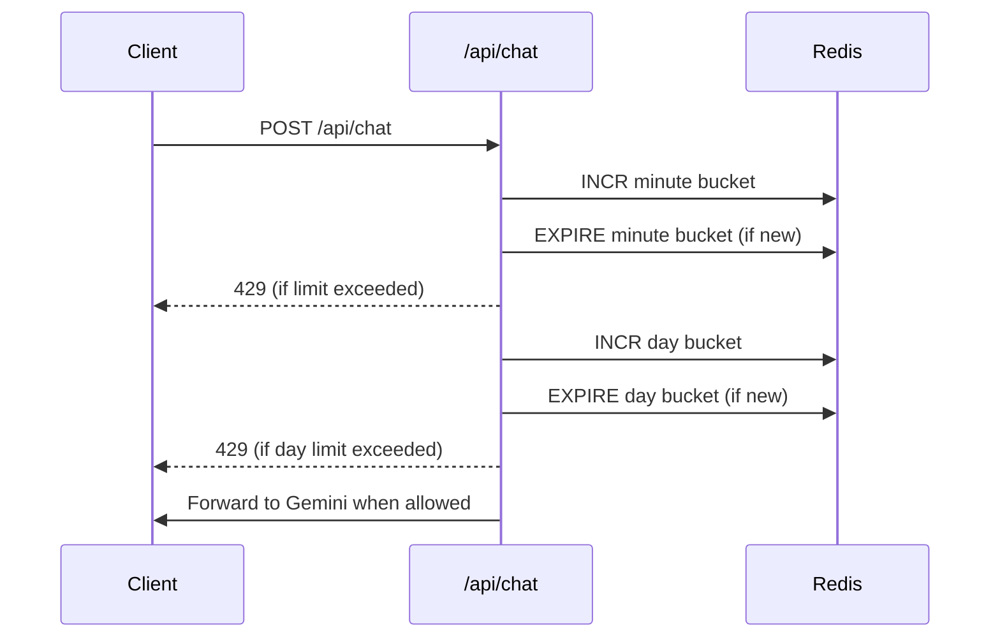

# Rate Limiting Guide

## Overview

Stardew Sage protects its Gemini integration with server-side rate limiting. The limiter lives in `src/lib/rate-limit.ts` and runs before any API call. This document explains how it works, how to tune thresholds, and how to monitor usage.

## Components

- **`src/lib/redis.ts`**: Wraps the Upstash Redis REST client.
- **`src/lib/rate-limit.ts`**: Implements windowed counters per identifier.
- **`src/app/api/chat/route.ts`**: Calls `checkRateLimit()` at the start of each request.

## Request Flow



## Environment Setup

Add these variables to `.env.local` and Vercel project settings:

```text
UPSTASH_REDIS_REST_URL=...
UPSTASH_REDIS_REST_TOKEN=...
```

Install the dependency:

```bash
npm install @upstash/redis
```

## Configuration

Default thresholds in `src/lib/rate-limit.ts`:

```typescript
const WINDOW_SECONDS = 60;           // one minute bucket
const MAX_REQUESTS_PER_WINDOW = 5;   // 5 requests per minute
const DAILY_WINDOW_SECONDS = 60 * 60 * 24;
const MAX_REQUESTS_PER_DAY = 100;    // 100 requests per day
```

Adjust these constants to match your quota or pricing constraints. Keys expire automatically, so Redis stays clean without manual eviction.

## Integration Points

### Server Route Guard

```typescript
const rateLimit = await checkRateLimit(clientIdentifier);
if (!rateLimit.success) {
  return NextResponse.json(
    { error: 'Too many requests. Please try again later.' },
    {
      status: 429,
      headers: { 'Retry-After': Math.ceil(rateLimit.retryAfter / 1000).toString() },
    },
  );
}
```

### Identifier Strategy

- For anonymous traffic, the IP header (`x-forwarded-for` or `x-real-ip`) is used.
- If you add authentication, prefer a user ID plus IP combination to defend against multi-account abuse.

## Monitoring

- Upstash dashboard shows per-key usage counts and logs.
- Add logging around 429 responses in `route.ts` if you want to visualize throttling events.
- Consider sending rate-limit metrics to an analytics service (Umami, Vercel Analytics) to tune thresholds.

## Extending

- **Global cap**: Add an app-wide key to guard aggregate usage.
- **Per-plan quotas**: Mix user tier information into the key, for example `chat:rl:minute:${tier}:${identifier}`.
- **Sliding window**: Switch from fixed buckets to sorted sets if you need exact sliding windows.

This rate limiting layer ensures the Gemini quota stays under control and helps contain spam or automated abuse. Tune values as traffic grows.
